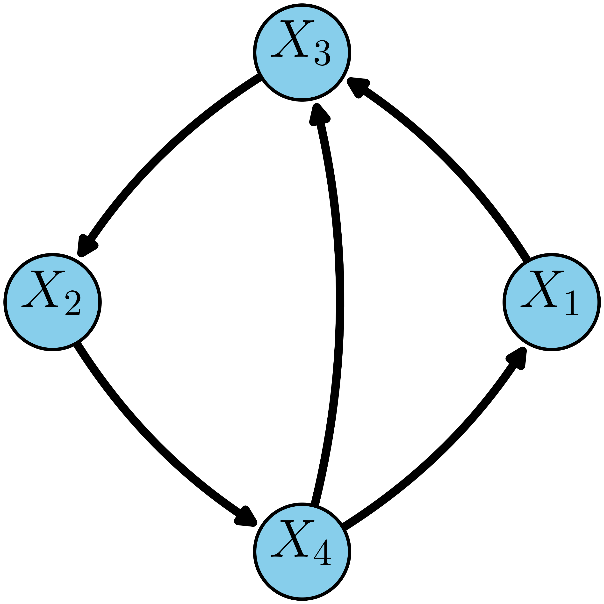
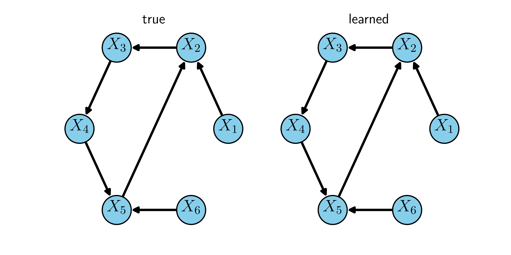

# dglearn
Python implementation of "Characterizing Distribution Equivalence and Structure Learning for Cyclic and Acyclic Directed Graphs," in ICML 2020

Link to paper: https://arxiv.org/abs/1910.12993

# Example Usage

## 1. Enumerate the equivalence class of a directed graph (up to reductions)
```python
from dglearn import *

# specify directed graph: construct AdjacencyStucture
n_vars = 4
edges = [(0, 2), (2, 1), (1, 3), (3, 0), (3, 2)]
var_names = {i:"$X_%d$"%(i+1) for i in range(n_vars)} 
dg_structure = AdjacencyStucture(n_vars, edge_list=edges)

# plot structure
plot_structure(edges, n_vars, save_path="../assets/dg4.png", figsize=(2.5, 2.5), name_list=var_names, latex=True,
               node_size=800, font_size=16, width=2.5, connectionstyle='arc3,rad=0.15', node_color='skyblue')
```


```python
# enumerate its equivalence class, up to column permutation (not including reducible graphs)
search = GraphEquivalenceSearch(dg_structure)
search.search_dfs()

# enumerate full equivalence class (not including reducible graphs)
# generally only feasible for relatively small directed graphs
search.expand_column_permutations()
equiv_class = [binary2array(bstr) for bstr in search.visited_graphs]

# plot elements of equivalence class
plot_collection({"Graph %d"%(i+1):array2edges(g) for i,g in enumerate(equiv_class)}, 4, n_cols=4, save_path="../assets/dg4_enumerated.png",
                name_list=var_names, latex=True, node_size=600, font_size=14, width=2, connectionstyle='arc3,rad=0.15', node_color='skyblue')
```


## 2. Learn a directed graph structure from data
```python
from dglearn import *

# example graph structure with 6 variables
n_vars = 6
edges = [(0, 1), (1, 2), (2, 3), (3, 4), (4, 1), (5, 4)]
var_names = {i:"$X_%d$"%(i+1) for i in range(n_vars)}

# generate random parameters for true graph structure
B_support = edges2array(edges, n_vars) - np.eye(n_vars)
B_sampled, s_sampled = sample_param_unif(B_support, B_low=0.2, B_high=0.8, var_low=1.0, var_high=3.0)

# generate samples from distribution specified by sampled parameters
X = sample_graph(B_sampled, s_sampled, 10000)

# learn structure using tabu search, plot learned structure
tabu_length = 4
patience = 4

manager = CyclicManager(X, bic_coef=0.5)
learned_support, best_score, log = tabu_search(manager, tabu_length, patience, first_ascent=False, verbose=1)

# perform virtual edge correction
print("virtual edge correction...")
learned_support = virtual_refine(manager, learned_support, patience=0, max_path_len=6, verbose=1)

# remove any reducible edges
learned_support = reduce_support(learned_support, fill_diagonal=False)

# plot true and learned directed graphs
plot_collection({'true': edges, 'learned': array2edges(learned_support)}, n_vars, name_list=var_names,
                latex=True, n_cols=2, node_size=600, font_size=14, width=2, save_path="../assets/dg6_learning_result.png")

# compute performance metric: SHD
true_graph = AdjacencyStucture(n_vars, edge_list=edges)
search = GraphEquivalenceSearch(true_graph)
search.search_dfs()
equiv_class = [binary2array(bstr) for bstr in search.visited_graphs]
shd = min_colperm_shd(equiv_class, learned_support)
print("SHD to nearest member of equivalence class: %d" % shd)

# compute performance metric: min KLD
precision_matrix = precision_matrix(B_sampled, s_sampled)
kld_best, Q_best = minimize_kld(precision_matrix, learned_support)
print("min. KLD metric: %0.3f"%kld_best)
```

